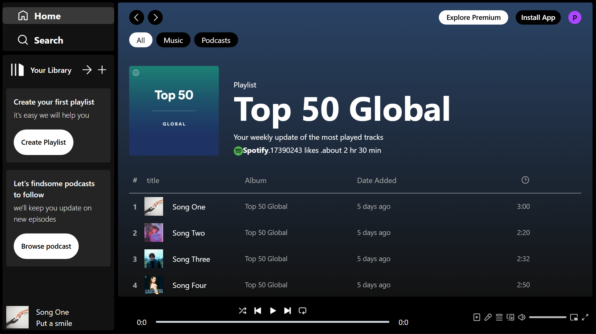

#  Spotify Frontend (Basic)

A clean and responsive frontend inspired by Spotify, built to deliver a smooth music listening experience with essential player functionalities.

This project focuses on creating an interactive UI with real-time playback controls and intuitive user experience.

---

##  Features

- ▶️ Play / Pause songs  
- ⏩ Seekbar functionality (track progress control)  
- 🎵 Display songs and albums  
- 💿 View album-wise songs  
- 🎨 Responsive UI with modern design  
- ⚡ Smooth user interactions  

---

##  Tech Stack

- **Frontend:** React.js  
- **Styling:** Tailwind CSS  
- **State Management:** React Hooks (useState, useContext)  
- **Build Tool:** Vite  

---

## 📸 Screenshots

## 📸 Screenshots

###  Home Page & player

  

